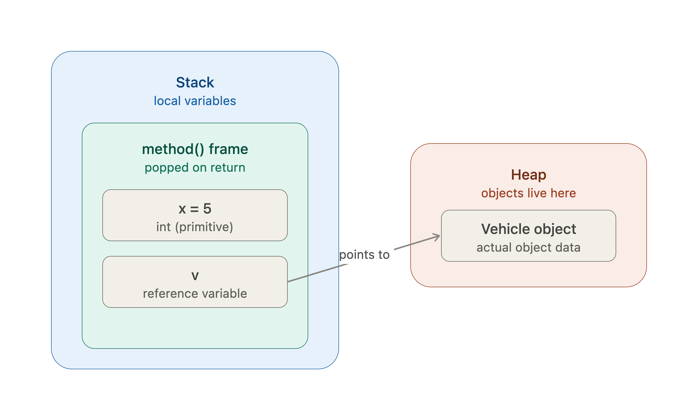

# Java Learning

## Day 2: Methods, Memory Model, and Strings

This is the day where Java stops behaving like Python. Read carefully — this is the foundation for every class you'll design in this course.

## 1. Method Overloading: Compile-Time Resolution

Java lets you define multiple methods with the same name but different parameter lists. The compiler picks which one to call at compile time, based on argument types.

```java
public class Calculator {
    int add(int a, int b) {
        return a + b;
    }
    double add(double a, double b) {
        return a + b;
    }
    int add(int a, int b, int c) {
        return a + b + c;
    }
}
```

Resolution rules, in order of preference: exact match → widening primitive conversion (int → long → double) → autoboxing → varargs. If two overloads are equally applicable, the compiler throws an ambiguous method call error at compile time — not runtime. This is different from Python, where you'd just get one function and handle types manually inside it.

### Varargs

```java
int sum(int... nums) {   // treated as int[] inside the method
    int total = 0;
    for (int n : nums) total += n;
    return total;
}
sum(1, 2, 3);       // works
sum();              // works, nums.length == 0
```

## 2. Stack vs. Heap: Where Things Actually Live

This is the model you need burned in:

Stack: stores local variables and method call frames. Each method call gets its own frame. When the method returns, its frame is popped and everything in it disappears.
Primitives declared locally live directly on the stack.
Reference variables also live on the stack — but they hold an address pointing into the heap, not the object itself.
Heap: stores all objects (anything created with new, plus arrays, plus String objects). Objects live here until no reference points to them anymore, at which point the Garbage Collector reclaims the memory.

```java
void method() {
    int x = 5;                 // x: stack
    Vehicle v = new Vehicle();  // v (the reference): stack. The actual Vehicle object: heap.
}
```

When method() returns, x and the reference v disappear from the stack. If nothing else referenced the Vehicle object, it's now eligible for garbage collection.



## 3. Gotcha #2: Java Is Always Pass-by-Value

Java has no pass-by-reference, ever. Full stop. What confuses people: when you pass an object, you're passing a copy of the reference (the address), not a copy of the object, and not the "real" reference either.

### Consequence A: Mutating Fields Through a Passed Reference Persists

```java
class Counter {
    int value = 0;
}

void increment(Counter c) {
    c.value = c.value + 1;   // mutates the object the reference points to
}

Counter counter = new Counter();
increment(counter);
System.out.println(counter.value); // 1 — the mutation is visible outside
```

This works because both counter (outside) and c (inside the method) are separate reference variables that happen to point to the same heap object. Mutating through either one mutates the one shared object.

### Consequence B: Reassigning the Parameter Does Not Persist

```java
void reassign(Counter c) {
    c = new Counter();   // c now points to a brand new object
    c.value = 100;
}

Counter counter = new Counter();
counter.value = 5;
reassign(counter);
System.out.println(counter.value); // still 5 — the outer 'counter' never changed
```

Inside reassign, c got pointed at a new object. That only changed what the local copy of the reference points to. The caller's counter variable still points to the original object. This is the exact mechanism people misdiagnose as "pass by reference" and get wrong.

Rule to internalize: you can never make a method reassign the caller's variable. You can only mutate the fields of the object the reference points to (if it's mutable), or return a new value and have the caller reassign it themselves.

```java
// The "Python swap trick" DOES NOT work in Java:
void swap(int a, int b) {
    int temp = a;
    a = b;
    b = temp;
    // no effect outside — a and b are local copies of primitives
}
```

To swap two object fields, you must either return both values (e.g., in an array/small object) or mutate fields directly, never rely on reassigning parameters.

## 4. Strings: Immutable and Pooled

String objects are immutable — once created, their content can never change. Every "modifying" operation returns a new String.

```java
String s = "hello";
s.concat(" world");        // does NOT change s — returns a new String that you're discarding
System.out.println(s);     // still "hello"

s = s.concat(" world");    // now s is reassigned to the new String
System.out.println(s);     // "hello world"
```

String Pool: string literals (written directly in code, like "hello") are stored in a special pooled area of the heap. Identical literals share the same object.

```java
String a = "hello";
String b = "hello";
System.out.println(a == b); // true — same pooled object

String c = new String("hello");
System.out.println(a == c); // false — new String() forces a new heap object outside the pool
```

This is why the rule from Day 1 stands: always use .equals() for String comparison, never ==, because you can never guarantee both strings came from the pool.

### Why Immutability Matters for Performance: `StringBuilder`

Because every concatenation creates a new object, doing this in a loop is expensive:

```java
String result = "";
for (int i = 0; i < 10000; i++) {
    result = result + i;   // creates 10,000 throwaway String objects
}
```

Use StringBuilder for anything built incrementally — it's a mutable character buffer:

```java
StringBuilder sb = new StringBuilder();
for (int i = 0; i < 10000; i++) {
    sb.append(i);          // mutates the SAME buffer, no new object each time
}
String result = sb.toString();  // convert to String once, at the end
```

StringBuffer is the same idea but thread-safe (synchronized) — slower, rarely needed unless you're sharing across threads. Default to StringBuilder.

## 5. Why This Matters for LLD (Preview)

When you design something like ParkingLot, every field that's a reference type (a List<Slot>, a Vehicle object) behaves exactly like the Counter example above. This is why the freeCodeCamp article's parkVehicle method works by mutating slot.vehicle = vehicle directly on the object pulled out of the list — it's relying on Consequence A. Understanding this is what lets you predict, before running code, whether a method needs to return something or can just mutate its way to the result.

## Practice: Do These Now

- **Pass-by-value proof:** Write a `Point` class with `int x, y`. Write a method `translate(Point p, int dx, int dy)` that mutates `p.x` and `p.y` directly (Consequence A), then verify that the caller sees the change. Write a second, intentionally buggy method `reset(Point p)` that does `p = new Point(0, 0);`, then prove that the caller's object is untouched (Consequence B).
- **Swap drill:** Try to write a method that swaps two `int` primitives passed as arguments. Prove that it does not work outside the method. Then write `swapFields(Point p1, Point p2)` that swaps the `x` and `y` values between two `Point` objects by mutating fields, not reassigning parameters.
- **StringBuilder drill:** Write a method that takes an `int[]` and returns a comma-separated `String` of its elements using `StringBuilder`, not `+=` concatenation. Handle the trailing-comma edge case cleanly.
- **Overload resolution:** Write three overloaded `describe` methods: `describe(int x)`, `describe(double x)`, and `describe(String x)`. Call `describe(5)`, `describe(5.0)`, and `describe('c')` (a `char`), and predict which overload each call hits before running it. The `char` call is the trick question.

Paste code when you want it checked, or say "goto Day 3" to keep moving.
