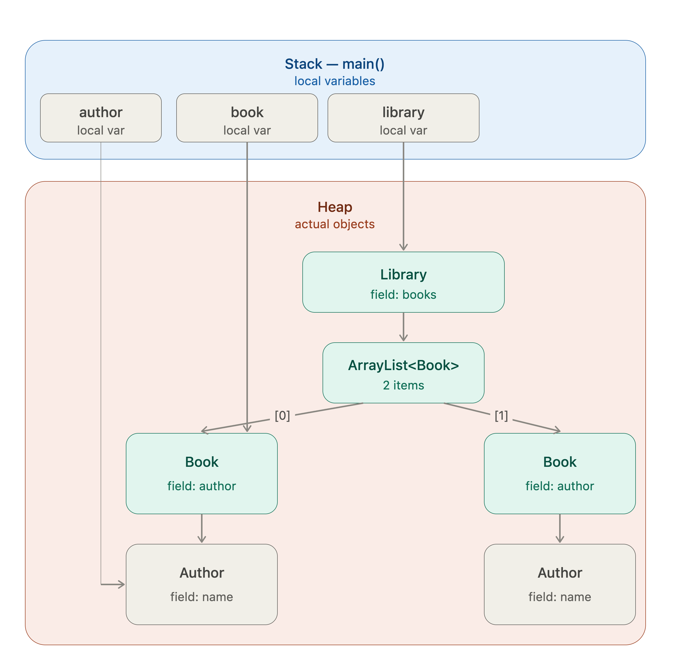

# Java Learning

## Day 2: Methods, Memory Model, and Strings

This is the day where Java stops behaving like Python. Read carefully — this is the foundation for every class you'll design in this course.

## 1. Method Overloading: Compile-Time Resolution

Java lets you define multiple methods with the same name but different parameter lists. The compiler picks which one to call at compile time, based on argument types.

```java
public class Calculator {
    int add(int a, int b) {
        return a + b;
    }
    double add(double a, double b) {
        return a + b;
    }
    int add(int a, int b, int c) {
        return a + b + c;
    }
}
```

Resolution rules, in order of preference: exact match → widening primitive conversion (int → long → double) → autoboxing → varargs. If two overloads are equally applicable, the compiler throws an ambiguous method call error at compile time — not runtime. This is different from Python, where you'd just get one function and handle types manually inside it.

### Varargs

```java
int sum(int... nums) {   // treated as int[] inside the method
    int total = 0;
    for (int n : nums) total += n;
    return total;
}
sum(1, 2, 3);       // works
sum();              // works, nums.length == 0
```

## 2. Stack vs. Heap: Where Things Actually Live

This is the model you need burned in:

Stack: stores local variables and method call frames. Each method call gets its own frame. When the method returns, its frame is popped and everything in it disappears.
Primitives declared locally live directly on the stack.
Reference variables also live on the stack — but they hold an address pointing into the heap, not the object itself.
Heap: stores all objects (anything created with new, plus arrays, plus String objects). Objects live here until no reference points to them anymore, at which point the Garbage Collector reclaims the memory.

```java
void method() {
    int x = 5;                 // x: stack
    Vehicle v = new Vehicle();  // v (the reference): stack. The actual Vehicle object: heap.
}
```

When method() returns, x and the reference v disappear from the stack. If nothing else referenced the Vehicle object, it's now eligible for garbage collection.


## 3. Gotcha #2: Java Is Always Pass-by-Value

Java has no pass-by-reference, ever. Full stop. What confuses people: when you pass an object, you're passing a copy of the reference (the address), not a copy of the object, and not the "real" reference either.

### Consequence A: Mutating Fields Through a Passed Reference Persists

```java
class Counter {
    int value = 0;
}

void increment(Counter c) {
    c.value = c.value + 1;   // mutates the object the reference points to
}

Counter counter = new Counter();
increment(counter);
System.out.println(counter.value); // 1 — the mutation is visible outside
```

This works because both counter (outside) and c (inside the method) are separate reference variables that happen to point to the same heap object. Mutating through either one mutates the one shared object.

### Consequence B: Reassigning the Parameter Does Not Persist

```java
void reassign(Counter c) {
    c = new Counter();   // c now points to a brand new object
    c.value = 100;
}

Counter counter = new Counter();
counter.value = 5;
reassign(counter);
System.out.println(counter.value); // still 5 — the outer 'counter' never changed
```

Inside reassign, c got pointed at a new object. That only changed what the local copy of the reference points to. The caller's counter variable still points to the original object. This is the exact mechanism people misdiagnose as "pass by reference" and get wrong.

Rule to internalize: you can never make a method reassign the caller's variable. You can only mutate the fields of the object the reference points to (if it's mutable), or return a new value and have the caller reassign it themselves.

```java
// The "Python swap trick" DOES NOT work in Java:
void swap(int a, int b) {
    int temp = a;
    a = b;
    b = temp;
    // no effect outside — a and b are local copies of primitives
}
```

To swap two object fields, you must either return both values (e.g., in an array/small object) or mutate fields directly, never rely on reassigning parameters.

## 4. Strings: Immutable and Pooled

String objects are immutable — once created, their content can never change. Every "modifying" operation returns a new String.

```java
String s = "hello";
s.concat(" world");        // does NOT change s — returns a new String that you're discarding
System.out.println(s);     // still "hello"

s = s.concat(" world");    // now s is reassigned to the new String
System.out.println(s);     // "hello world"
```

String Pool: string literals (written directly in code, like "hello") are stored in a special pooled area of the heap. Identical literals share the same object.

```java
String a = "hello";
String b = "hello";
System.out.println(a == b); // true — same pooled object

String c = new String("hello");
System.out.println(a == c); // false — new String() forces a new heap object outside the pool
```

This is why the rule from Day 1 stands: always use .equals() for String comparison, never ==, because you can never guarantee both strings came from the pool.

### Why Immutability Matters for Performance: `StringBuilder`

Because every concatenation creates a new object, doing this in a loop is expensive:

```java
String result = "";
for (int i = 0; i < 10000; i++) {
    result = result + i;   // creates 10,000 throwaway String objects
}
```

Use StringBuilder for anything built incrementally — it's a mutable character buffer:

```java
StringBuilder sb = new StringBuilder();
for (int i = 0; i < 10000; i++) {
    sb.append(i);          // mutates the SAME buffer, no new object each time
}
String result = sb.toString();  // convert to String once, at the end
```

StringBuffer is the same idea but thread-safe (synchronized) — slower, rarely needed unless you're sharing across threads. Default to StringBuilder.

## 5. Why This Matters for LLD (Preview)

When you design something like ParkingLot, every field that's a reference type (a List<Slot>, a Vehicle object) behaves exactly like the Counter example above. This is why the freeCodeCamp article's parkVehicle method works by mutating slot.vehicle = vehicle directly on the object pulled out of the list — it's relying on Consequence A. Understanding this is what lets you predict, before running code, whether a method needs to return something or can just mutate its way to the result.

## Practice: Do These Now

- **Pass-by-value proof:** Write a `Point` class with `int x, y`. Write a method `translate(Point p, int dx, int dy)` that mutates `p.x` and `p.y` directly (Consequence A), then verify that the caller sees the change. Write a second, intentionally buggy method `reset(Point p)` that does `p = new Point(0, 0);`, then prove that the caller's object is untouched (Consequence B).
- **Swap drill:** Try to write a method that swaps two `int` primitives passed as arguments. Prove that it does not work outside the method. Then write `swapFields(Point p1, Point p2)` that swaps the `x` and `y` values between two `Point` objects by mutating fields, not reassigning parameters.
- **StringBuilder drill:** Write a method that takes an `int[]` and returns a comma-separated `String` of its elements using `StringBuilder`, not `+=` concatenation. Handle the trailing-comma edge case cleanly.
- **Overload resolution:** Write three overloaded `describe` methods: `describe(int x)`, `describe(double x)`, and `describe(String x)`. Call `describe(5)`, `describe(5.0)`, and `describe('c')` (a `char`), and predict which overload each call hits before running it. The `char` call is the trick question.

Paste code when you want it checked, or say "goto Day 3" to keep moving.

---

## Day 3: Classes, Objects, Construction

How objects (and objects of objects) actually get built.

This is the day you specifically asked for. Let's go deep.

### 1. What `new` Actually Does, Step by Step

```java
Vehicle v = new Vehicle("Honda", "Red");
```

When this line executes, in order:

1. **Memory allocation:** The JVM allocates a block of memory on the heap sized to hold `Vehicle`'s fields.
2. **Default initialization:** Every field gets its zero-value default first (`0` for numerics, `false` for `boolean`, `null` for references), before any of your code runs.
3. **Instance initializer blocks and field initializers run**, in the order they appear in the source file.
4. **The constructor body runs**, whichever one matches the arguments you passed.
5. **The reference to the new object is returned** and assigned to `v`.

That ordering (2 -> 3 -> 4) is guaranteed by the Java Language Specification. This matters because, by the time your constructor body starts executing, every field already has some value, even fields you have not touched yet.

### 2. Constructors: What They Really Are

A constructor is not a method that creates the object. Allocation already happened in step 1 above. A constructor's real job is to **initialize** the already-allocated object.

```java
class Vehicle {
    String model;
    String color;

    Vehicle(String model, String color) {
        this.model = model;
        this.color = color;
    }
}
```

- No return type, not even `void`: constructors never return a value. This is how the compiler tells a constructor apart from a method that happens to share the class's name.
- The constructor must match the class name exactly.
- `this.model = model`: `this` disambiguates the field from the parameter, since they share a name. `this.model` means the field on the object being constructed; `model` means the parameter passed in.

If you write no constructor at all, the compiler silently generates a default no-arg constructor for you: `Vehicle() {}`. The moment you write any constructor yourself, that free constructor disappears. If you still want a no-arg version, you must write it explicitly.

### 3. Constructor Overloading and Chaining with `this(...)`

You can have multiple constructors, just like overloaded methods:

```java
class Vehicle {
    String model;
    String color;

    Vehicle(String model, String color) {
        this.model = model;
        this.color = color;
    }

    Vehicle(String model) {
        this(model, "White");   // delegates to the other constructor; must be the first line
    }

    Vehicle() {
        this("Unknown");        // chains to the constructor above
    }
}
```

`this(...)` calls another constructor in the same class. It must be the very first statement in the constructor body. This lets you have one real constructor that does the actual work, and thinner constructors that supply defaults and delegate.

### 4. `this`: The Four Things It Actually Means

`this` is a reference to the current object: the object this code is running on behalf of.

```java
class Point {
    int x, y;

    Point(int x, int y) {
        this.x = x;          // (1) disambiguate field from parameter
        this.y = y;
    }

    Point() {
        this(0, 0);          // (2) call another constructor
    }

    Point shift(int dx) {
        this.x += dx;
        return this;         // (3) return the current object itself
    }

    void compareTo(Point other) {
        if (this == other) { // (4) compare this exact object's identity
            System.out.println("same object");
        }
    }
}
```

`this` does not exist in `static` methods or static context because it means the current instance, and static code does not belong to any instance.

### 5. Static vs. Instance Members: The Real Distinction

- **Instance member** (a field or method without `static`): belongs to each object separately. Every `Vehicle` you create gets its own `model` and its own `color`.
- **Static member:** belongs to the class itself and is shared across every instance. There is exactly one copy, no matter how many objects you create.

```java
class Vehicle {
    static int totalVehiclesCreated = 0;  // one copy, shared by all Vehicles
    String model;                         // separate copy per Vehicle

    Vehicle(String model) {
        this.model = model;
        totalVehiclesCreated++;           // every constructor call bumps the same counter
    }
}
```

```java
Vehicle v1 = new Vehicle("Civic");
Vehicle v2 = new Vehicle("Corolla");
System.out.println(Vehicle.totalVehiclesCreated); // 2
```

This is a common LLD pattern: a `static` counter or registry shared across all instances of a class, such as an auto-generated unique ID.

### 6. Static Blocks vs. Instance Initializer Blocks

```java
class Vehicle {
    static int registrySize;
    String model;

    static {
        // Runs exactly once, when the class is first loaded by the JVM.
        registrySize = 0;
        System.out.println("Vehicle class loaded");
    }

    {
        // Runs every time an object is created, before the constructor body.
        System.out.println("New Vehicle object being built");
    }

    Vehicle(String model) {
        this.model = model;
        System.out.println("Constructor running");
    }
}
```

Full ordering when you run `new Vehicle("Civic")` for the first time in a program:

1. **Class loading:** static field defaults, static field initializers, and static blocks, in source order.
2. **Object construction:** instance field defaults, instance field initializers and instance initializer blocks, in source order, followed by the constructor body.

Static blocks are rare in day-to-day code but are used for one-time setup, such as loading configuration. Instance initializer blocks are rarer still; most people put shared logic directly in the constructor. You still need to recognize the ordering when you see it.

### 7. Composition: Objects of Objects

A class field does not have to be a primitive or a `String`; it can be another object you defined:

```java
import java.util.ArrayList;
import java.util.List;

class Author {
    String name;

    Author(String name) {
        this.name = name;
    }
}

class Book {
    String title;
    Author author;          // Book HAS-A Author: composition

    Book(String title, Author author) {
        this.title = title;
        this.author = author;
    }
}

class Library {
    List<Book> books;       // Library HAS-A list of Books

    Library() {
        books = new ArrayList<>();
    }

    void addBook(Book book) {
        books.add(book);
    }
}
```

Building the object graph:

```java
Author author = new Author("Robert Martin");
Book book = new Book("Clean Code", author);
Library library = new Library();
library.addBook(book);
```

Trace exactly what happens on the heap:

1. `new Author("Robert Martin")`: an `Author` object is allocated, its `name` field is set, and a reference to it is stored in the local variable `author`.
2. `new Book("Clean Code", author)`: a `Book` object is allocated. Its `title` is set directly, and its `author` field is set to the same reference held by `author`. The `Book` does not get its own copy of the `Author` object.
3. `new Library()`: a `Library` object is allocated. Its constructor creates an empty `ArrayList` and stores a reference to that list in `books`.
4. `library.addBook(book)`: the `ArrayList` inside `library` now holds a reference to the same `Book` object.

You end up with a chain of references: `library -> ArrayList -> Book -> Author`. Nothing was copied. Every object is singular, and multiple things can hold references to the same one. This is the Day 2 stack/heap model one level deeper: the heap object `Book` holds a reference field pointing to another heap object, `Author`.



If two different `Book` objects are constructed with the same `author` reference, mutating that shared `Author`'s name is visible through both books because there is only one `Author` object, referenced from two places.

---

### Practice: Do This Now

Build the `Library` -> `Book` -> `Author` example above, then extend it:

1. Add a `List<Book> books` to `Author` too, representing the books an author has written. Do not create a two-way link back from `Book` to the list on `Author` unless you also add the `Book` to it explicitly. Adding a `Book` to a `Library` does not automatically add it to the `Author`'s list; these are separate object graphs unless you write code to keep them in sync.
2. Add a static field `Library.totalBooksAdded` that increments every time `addBook` is called across the whole `Library` class, not per instance. Create two separate `Library` objects, add books to each, and prove whether the counter is shared or separate. Predict the answer before running it.
3. Add a constructor chain to `Book`: a full constructor `Book(String title, Author author)` and an overload `Book(String title)` that chains to it using `this(...)` with an `Author` object representing `"Unknown"`.
4. Write a `main` method that constructs 3 authors and 5 books distributed among them, adds all 5 to one `Library`, then loops over `library.books` and prints each book's title alongside its author's name. This proves the object graph is navigable end to end.

---

## Day 4: Encapsulation - Access Control, Immutability, and Defensive Copying

### 1. Why Encapsulation Is More Than "Make Fields Private"

The textbook definition, "hide internal state, expose behavior," undersells what is actually at stake. The real goal is that **an object should be able to guarantee its own invariants**. If a `BankAccount`'s balance can never legally go negative, encapsulation means there is no possible sequence of calls from outside the class that can produce a negative balance. This is true not because callers are well-behaved, but because the class makes it structurally impossible.

```java
class BankAccount {
    private double balance;   // no outside code can touch this directly

    BankAccount(double initialBalance) {
        if (initialBalance < 0) {
            throw new IllegalArgumentException("Cannot open with negative balance");
        }
        this.balance = initialBalance;
    }

    void withdraw(double amount) {
        if (amount > balance) {
            throw new IllegalStateException("Insufficient funds");
        }
        balance -= amount;
    }

    double getBalance() {
        return balance;
    }
}
```

If `balance` were public, any code could do `account.balance = -500;` directly, bypassing every rule the class tries to enforce. Private fields are not about secrecy; they **force every mutation through a method that can validate it**.

### 2. Getters and Setters: A Design Decision

Coming from Python, you might reach for "make everything private, then add a getter and setter for every field" as a reflex. Resist that. A setter that only does `this.x = x;` with no validation provides zero benefit over a public field; it is the same lack of protection with more boilerplate.

Ask, for every field: Does this need a getter? Does it need a setter? Does the setter need to validate anything?

```java
class Employee {
    private String name;
    private double salary;

    Employee(String name, double salary) {
        this.name = name;
        setSalary(salary);   // route construction through the validating setter
    }

    String getName() {
        return name;
    }

    double getSalary() {
        return salary;
    }

    void setSalary(double salary) {
        if (salary < 0) {
            throw new IllegalArgumentException("Salary cannot be negative");
        }
        this.salary = salary;
    }
}
```

The constructor calls `setSalary(salary)` instead of assigning `this.salary` directly. The validation logic exists in exactly one place, so construction and later mutation follow the same rule.

### 3. Immutability: Objects That Cannot Change After Construction

An immutable object's state is fixed forever once constructed. This eliminates unexpected mutation and makes objects safe to share without defensive copying at every handoff.

Recipe for a truly immutable class:

```java
final class Point {                      // (1) cannot be subclassed
    private final int x;                 // (2) private and final
    private final int y;

    Point(int x, int y) {
        this.x = x;
        this.y = y;
    }

    int getX() { return x; }             // (3) getters only
    int getY() { return y; }

    Point translate(int dx, int dy) {    // (4) return a new object
        return new Point(this.x + dx, this.y + dy);
    }
}
```

Using it:

```java
Point p1 = new Point(0, 0);
Point p2 = p1.translate(5, 5);   // p1 is untouched; p2 is new
System.out.println(p1.getX());   // still 0
System.out.println(p2.getX());   // 5
```

This is precisely how `String` behaves. `.concat()` does not mutate the original string; it returns a new `String`. The same pattern appears in `Integer`, `Double`, `LocalDate`, and `BigDecimal`.

### 4. The Gotcha: Mutable Fields Inside "Immutable" Classes

```java
final class Team {
    private final String name;
    private final List<String> members;

    Team(String name, List<String> members) {
        this.name = name;
        this.members = members;   // stores the caller's list reference
    }

    List<String> getMembers() {
        return members;           // returns the internal list reference
    }
}
```

This class looks immutable, but it is not:

```java
List<String> list = new ArrayList<>();
list.add("Alice");
Team team = new Team("Alpha", list);

list.add("Bob");                        // changes the Team's internal list
System.out.println(team.getMembers());  // [Alice, Bob]

team.getMembers().add("Eve");           // direct mutation through the getter
```

Both bugs happen because `members` is a reference type. Assigning `this.members = members` does not copy the list; it stores the same reference the caller has. The fix is **defensive copying** on the way in and on the way out:

```java
final class Team {
    private final String name;
    private final List<String> members;

    Team(String name, List<String> members) {
        this.name = name;
        this.members = new ArrayList<>(members);   // copy on the way in
    }

    List<String> getMembers() {
        return new ArrayList<>(members);            // copy on the way out
    }
}
```

Now the caller's original list and the `Team`'s internal list are two separate `ArrayList` objects. Mutating one has no effect on the other. Final fields alone are not sufficient when a field refers to something mutable.

### 5. Packages: Organizing Classes into Namespaces

```java
package com.example.parkinglot;

public class Vehicle {
    // ...
}
```

- The package declaration must be the first line in the file; only comments can precede it.
- The directory structure must mirror the package name: `com.example.parkinglot` lives in `com/example/parkinglot/Vehicle.java`.
- To use a class from another package, write `import com.example.parkinglot.Vehicle;`.
- Classes in the same package can see each other's package-private members; classes in different packages cannot.

For now, single-file exercises in VS Code do not need packages. Real LLD projects will be organized into packages such as `parkinglot.model` and `parkinglot.strategy`, so get comfortable with the syntax now.

---

### Practice: Do These Now

1. **`BankAccount` with real invariant enforcement:** Create a private `balance` field. Reject negative initial balances, and make `deposit(amount)` reject negative or zero amounts. Make `withdraw(amount)` reject amounts that exceed the balance or are negative or zero. Do not create a public setter for `balance`; change it only through `deposit` and `withdraw`.
2. **Immutable `Money` class:** Create a `final` class with private final `int amountInCents` and `String currency` fields, getters, and an `add(Money other)` method that returns a new `Money` object. Throw an exception if the currencies do not match.
3. **Defensive copying bug, then fix:** Write a `Roster` class that takes a `List<String>` in its constructor and stores it without copying. Prove the bug by mutating the original list from outside and showing that the `Roster`'s internal state changes. Then fix `Roster` with defensive copies in the constructor and getter, and prove the bug is gone.
4. **Getter/setter judgment call:** Design a `Temperature` class that stores Celsius internally but exposes `getCelsius()` and a computed `getFahrenheit()`. Do not add a setter; set values only at construction. Compute Fahrenheit on demand instead of storing a second field, because duplicated state can go out of sync.
